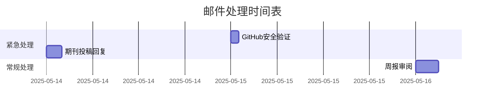

```markdown
# 邮件处理报告

## 📊 分类统计
| 优先级   | 类别            | 数量 |
|----------|-----------------|------|
| 高       | 学术合作        | 1    |
| 中高     | 安全提醒        | 1    |
| 中       | 内部沟通        | 1    |
| 低       | 产品推广        | 2    |

---

## 🔝 高优先级处理
### 📌 学术合作
**邮件标题**：近期的期刊投递——同事 陈序  
**发件人**：Vicky<751633067@qq.com>  
**紧急原因**：来自期刊合作方的重要投稿机会  
**处理建议**：
1. 在24小时内回复确认意向
2. 下载附件查看Call for Papers详情
3. 与实验室成员讨论投稿可行性

---

## ⚠️ 需立即处理邮件
### 🔐 安全提醒
**邮件标题**：[[GitHub] A third-party OAuth application...]  
**发件人**：李芯钰<lixinyu242@mails.ucas.ac.cn>  
**紧急原因**：账户安全相关操作提醒  
**处理建议**：
1. 立即验证OAuth应用授权是否本人操作
2. 如非本人授权，需在1小时内：
   - 撤销第三方应用权限
   - 修改GitHub账户密码
   - 启用两步验证

---

## 📑 常规处理建议
### 📈 内部沟通
**邮件标题**：第11周周报——周晓晓  
**发件人**：周婉婷<zhouwanting24@mails.ucas.ac.cn>  
**处理建议**：
1. 3个工作日内阅读并批注关键进展
2. 重点关注：
   - 机械臂控制算法23%的误差优化
   - BCI与机械臂协同实验方案
3. 安排下周组会讨论摩擦力补偿方案

### 📨 产品推广
**邮件标题**：担心错过重要邮件？/邮件办公，如此轻松！  
**发件人**：网易邮箱助手  
**处理建议**：
1. 直接归档至「推广邮件」分类
2. 可设置发件人过滤规则避免同类邮件干扰

---

## ⏰ 处理时间规划建议
